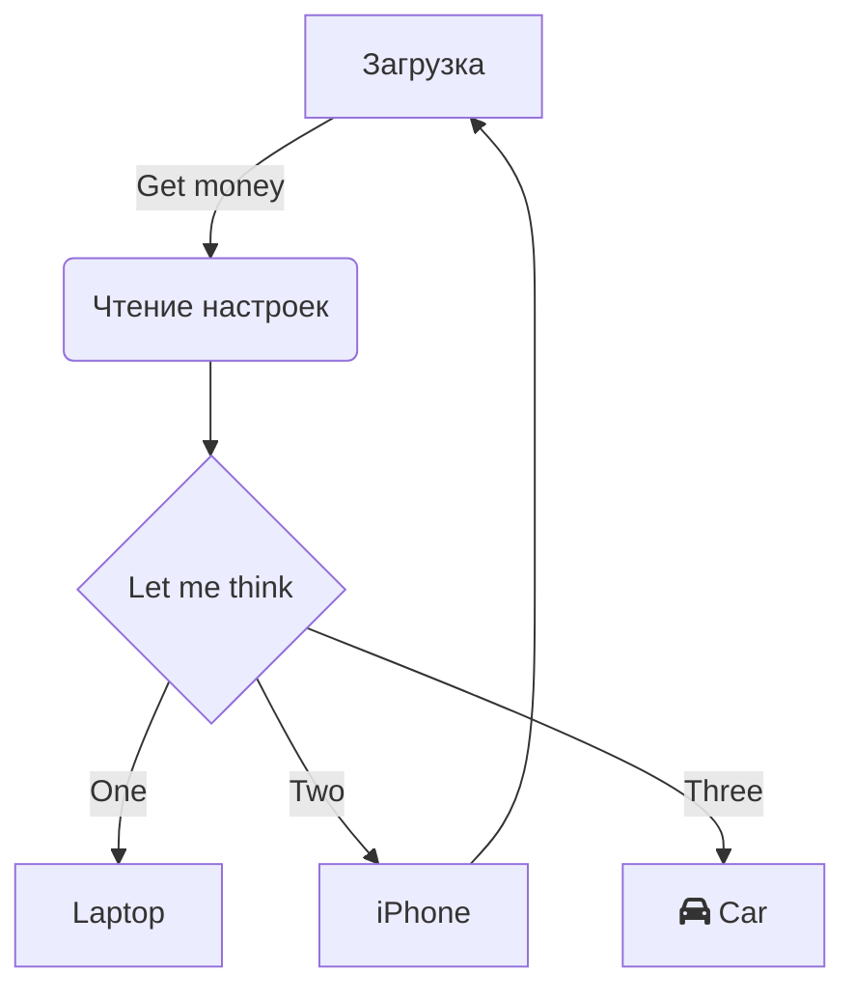

# Использование

```mermaid
graph TD
  A[Загрузка] -->|Get money| B(Чтение настроек)
  B --> C{Let me think}
  C -->|One| D[Laptop]
  C -->|Two| E[iPhone]
  C -->|Three| F[fa:fa-car Car]
  E--> A
```
